# 第四天笔记

## 设置主轴方向

主轴默认是水平方向, 侧轴默认是垂直方向

修改主轴方向属性: flex-direction  

| 属性值         | 作用             |
| -------------- | ---------------- |
| `row  `        | 行, 水平(默认值) |
| `column  `     | *列,  垂直       |
| row-reverse    | 行, 从右向左     |
| column-reverse | 列, 从下向上     |

语法：

~~~css
flex-direction：column;
~~~

修改完毕，主轴是Y轴， 侧轴是X轴。

### 修改主轴经常的使用场景：

请完成如下场景：

比如：

 

 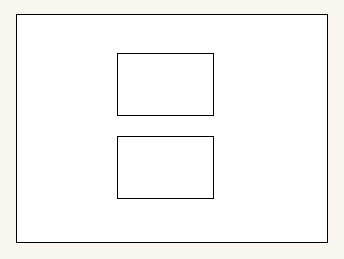

~~~css

~~~

## 弹性盒子换行

> 特性：  给父亲添加了 `display: flex;` 所有的子盒子（弹性盒子）都会在一行显示，不会自动换行。

弹性盒子换行显示 : flex-wrap:

语法：

~~~css
flex-wrap: wrap;
~~~

 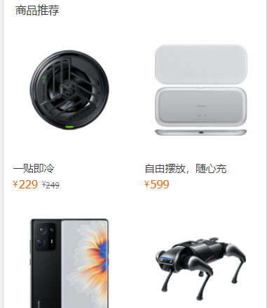

## 设置侧轴对齐方式

注意:

1. 此处设置侧轴**多行**的垂直对齐方式。  `align-content`（少）
2. 和前面学过的 `align-items` （侧轴**单行**垂直对齐） （多）
3. align 垂直 比如 align-items 垂直对齐      align-content 多行垂直对齐
4. content     主轴  justify-content     align-content  侧轴多行对齐

~~~css
align-content：center；
~~~

| 属性值        | 作用                                                |
| ------------- | --------------------------------------------------- |
| flex-start    | 默认值, 起点开始依次排列                            |
| flex-end      | 终点开始依次排列                                    |
| center        | 沿主轴居中排列                                      |
| space-around  | 弹性盒子沿主轴均匀排列,  空白间距均分在弹性盒子两侧 |
| space-between | 弹性盒子沿主轴均匀排列,  空白间距均分在相邻盒子之间 |

## flex 总结梳理

flex 它是一种布局方式。 主要目的是通过父盒子控制子盒子如何排列,一定是亲爸爸和亲儿子

### 主轴排列方式（重点）

默认的水平，但是可以转换。

1. 如果给父盒子添加 display: flex 

   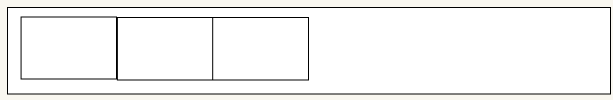

2.  justify-content: center;

   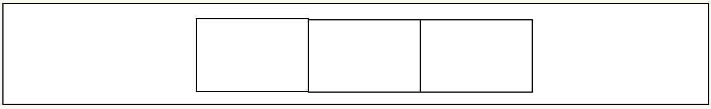

3. justify-content: **space-between;** 左右两侧无缝隙

   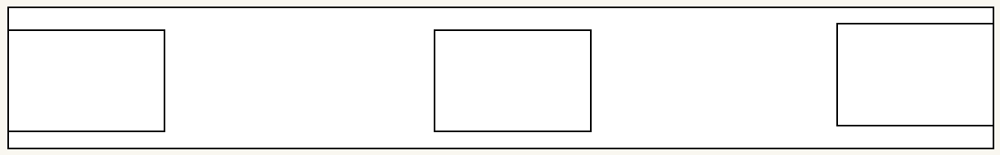

4. justify-content: space-around;   两倍关系

   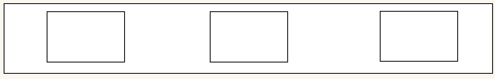

5. justify-content: space-evenly;   缝隙均等

   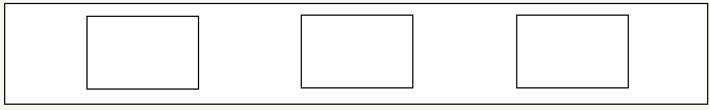

### 侧轴对齐方式-单行对齐（重点）

1. 默认的对齐方式  stretch 拉伸

2. 顶对齐  flex-start

   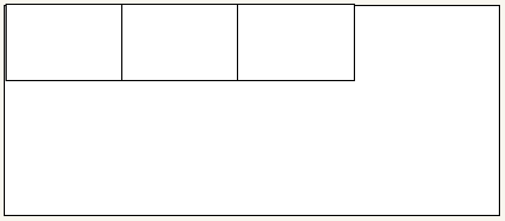

2.  align-items: center;   (重点)

   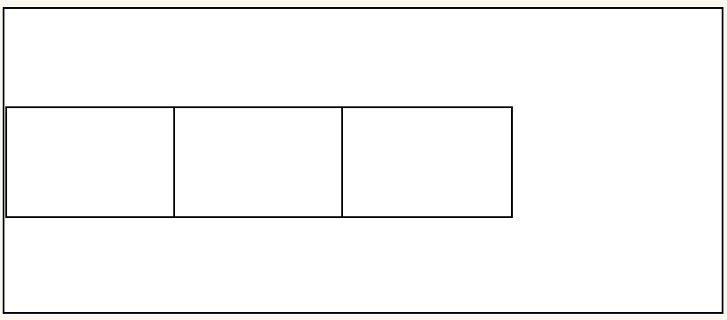

### 侧轴对齐方式-多行

1.  align-content: space-between;

   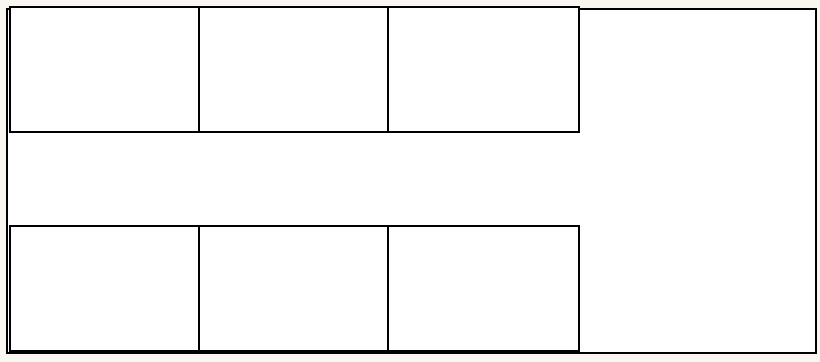

2. align-content: space-around; 

   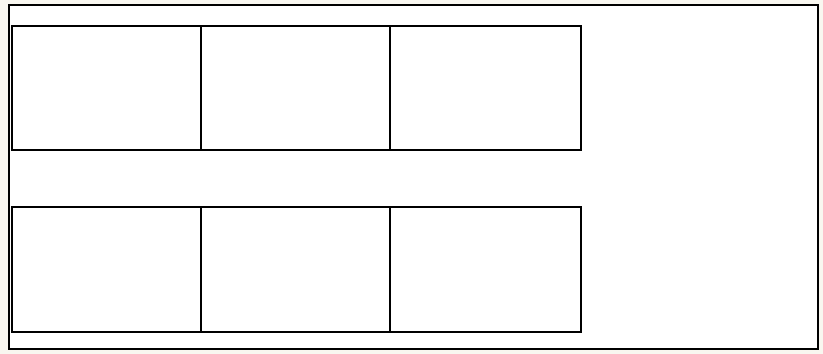

3. align-content: space-evenly; 

   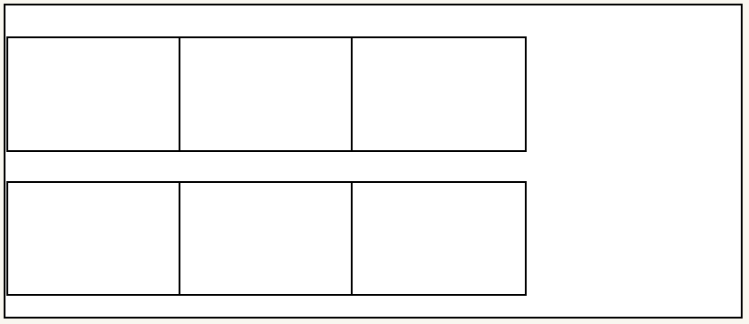

4. align-content: center;

   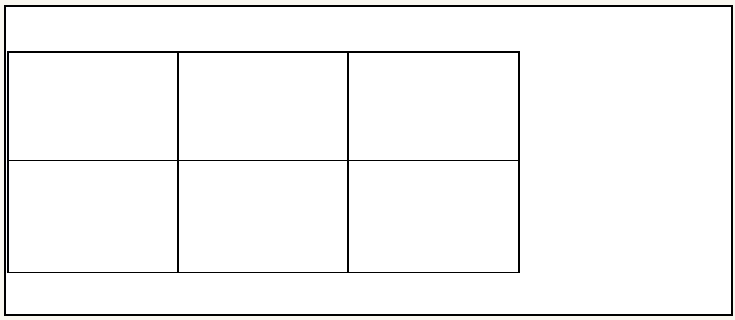

### 弹性盒子换行（重点）

特别是多行的情况下，我们需要给弹性盒子换行，给 父盒子 弹性容器加。

~~~css
flex-wrap: wrap;
~~~

### 设置主轴方向（重点）

~~~css
flex-direction: column;
~~~

让我们的主轴设置为垂直。 默认的是 row  水平的。

 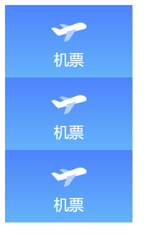

